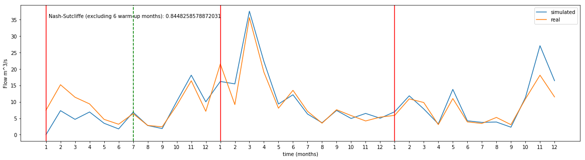

PySTREAM
===============================

Overview
--------

Python implementation of the [STREAM hydrological rainfall-runoff model](https://www.sciencedirect.com/science/article/pii/S1464190999000490?via%3Dihub)

See the [pystream-example](https://github.com/martibosch/pystream-example) repository for some example usage. More examples and documentation will be coming shortly.

Installation / Usage
--------------------

To install use pip:

    $ pip install pystream-model

Or clone the repo:

    $ git clone https://github.com/martibosch/pystream.git
    $ python setup.py install
